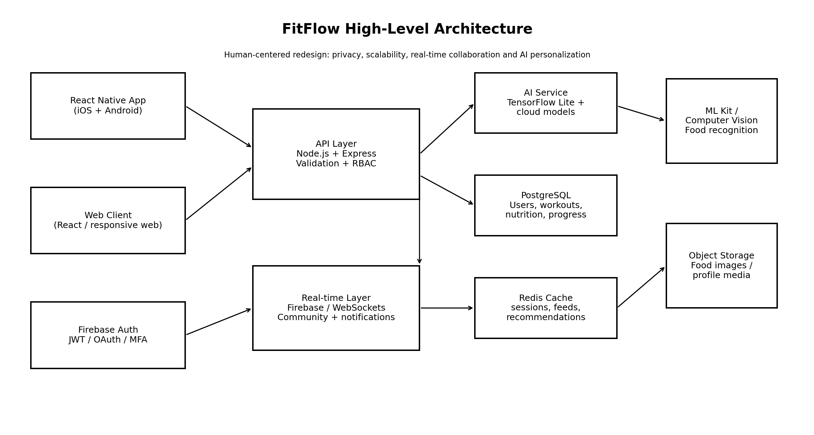

# ADR-001: FitFlow Technology and Architecture Stack

| Field | Decision |
|---|---|
| **Status** | Accepted for redesign implementation |
| **Context** | FitFlow needs rapid cross-platform delivery, high performance, real-time community features, AI personalization, nutrition computer vision and strong privacy controls. |
| **Decision** | React Native for mobile, React for web where needed, Node.js/Express for the core API, PostgreSQL as the system of record, Firebase Authentication and selected real-time services, Redis caching, and a separate AI service with TensorFlow Lite/on-device inference plus cloud models. |
| **Rationale** | Balances speed, code reuse, ecosystem maturity, structured health data, AI integration and maintainability. Separating AI and real-time workloads reduces coupling and allows independent scaling. |
| **Security** | TLS, least privilege, token validation, role-based authorization, data minimization, encryption, audit logs, consent and deletion controls. |
| **Scalability** | Horizontal API scaling, PostgreSQL indexing/partitioning, Redis caching, managed real-time infrastructure, independently scalable AI services. |
| **Alternatives rejected** | Flutter as primary mobile framework (strong alternative, but less aligned with the case study's React/Node direction); native-only iOS/Android (higher duplication); MongoDB-only architecture (less suitable as the primary structured health-data store). |
| **Consequences** | The team must manage multiple services and clearly defined data boundaries, but gains flexibility and better separation of concerns. |

---

## Architecture Overview

### Key Components

| Component | Responsibility |
|---|---|
| React Native mobile app | Dashboard, daily flow suggestions, workout creator, social features, nutrition camera and offline-first interactions |
| React web client | Browser access to account, progress and community, plus limited management/reporting |
| Node.js + Express API | Business logic, validation, authorization, user/workout/nutrition APIs and orchestration |
| Firebase Authentication | Sign-in providers, token generation and the authentication lifecycle |
| PostgreSQL | System of record for users, workout plans, workout history, nutrition logs, progress and subscription metadata |
| Firebase real-time services | Real-time social feed updates, challenge activity and notifications/events |
| Redis | Caching for recommendations, feeds and session/rate-limited data |
| AI service | Generates personalized workout plans and recommendations using cloud models |
| TensorFlow Lite / on-device ML | On-device inference for low-latency personalization, keeping data on the phone where possible |
| ML Kit / computer vision | Food recognition from camera images for nutrition logging |
| Object storage | Food images and profile media |

### Critical Data Flows

1. **Personalized workout:** User activity and preferences → mobile app → API → AI service returns the best-suited workout → stored in PostgreSQL → shown on the daily flow card.
2. **Social sharing:** User creates a post/challenge activity → API authorization → real-time layer → subscribed users → feed/cache update.
3. **Nutrition tracking:** Camera image → on-device/ML Kit processing → recognized food → user confirms → API → PostgreSQL → progress dashboard.
4. **Authentication:** User logs in via Firebase Authentication → receives token → API validates token → access to FitFlow resources.

### Security, Scalability and Integration Considerations

- **Security:** Data minimization, explicit consent, encryption in transit and at rest, RBAC, audit logs, retention/deletion policies, managed secrets.
- **Scalability:** Stateless API instances scaled horizontally; Redis to reduce database load; AI and real-time layers scale independently.
- **Integration:** The API is the single entry point for clients; Firebase handles identity and real-time events; the AI service is called only through the API.
